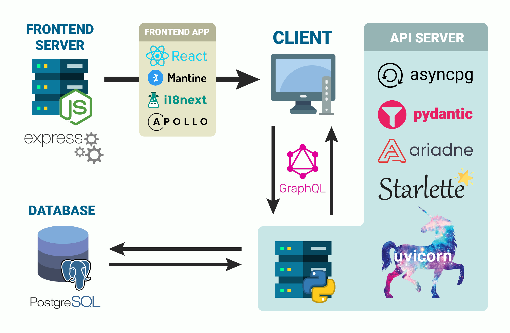

# e-Business Register

## Description
A project for my portfolio which showcases the use of GraphQL for communication between a Vite + React frontend and a Starlette + PostgreSQL backend. 
The backend server source code has **2324** lines of code, where the most important source files are covered **100%** by tests (**~80%** total). 
The frontend source code has **768** lines of code without any tests, because the code is simple enough that it doesn't require any tests. 
Altogether, the project consists of about **3100** lines of source code.

## How to run

1. Install Node.js from https://nodejs.org/en/download/
2. Install Python from https://www.python.org/downloads/
3. Install PostgreSQL from https://www.postgresql.org/download/
4. Download this repository and unpack the rik-business-register folder into the location of your choice.
5. Navigate into the scripts subfolder and execute both server scripts.
6. After the servers have started up, execute the "open_browser.bat" script.
7. ???
8. Profit!

*Note 1: The guide above is valid for Windows OS.*  
*Note 2: It is recommended to install PostgreSQL with the default settings (port: **5432**, user/pass: **postgres**)*    
*If you install Postgres with custom settings, you must also edit the app_config.toml file in the backend folder.*  

## Tech Stack

